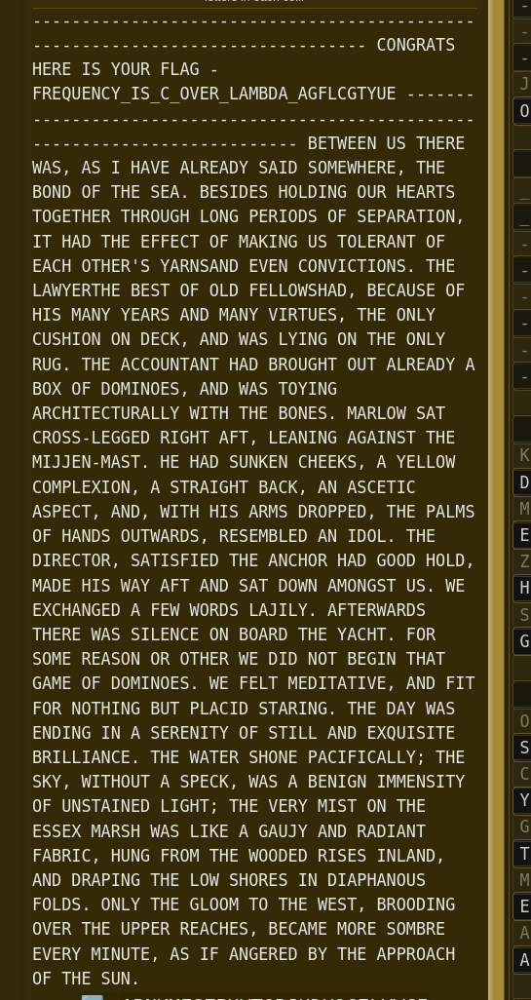
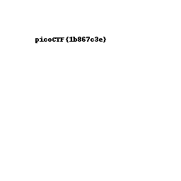

# Custom Encryption

I started out by trying to convert the encrypted text to semi-encrypted text. For this I would have to get the `shared_key`.

Parsing of encrypted data:
```python
a = int(lines[0].split('= ')[1])
b = int(lines[1].split('= ')[1])
cipher = eval(lines[2].split(': ')[1])
```

Since `p` and `g` seemed to be fixed to values `97` and `31` respectively, I could get `u` and `v` with the same `generator` function in the encryption code which interns helps me get the key.

There is a test for a valid key in the encryption code, but since I already have encrypted data I ignored it.

```python
u = generator(g,a,p)
v = generator(g, b, p)

shared_key = generator(v, a, p)
```

With this I retrieve the `shared_key` and hence convert the encrypted text to a semi-encrypted format with:
```python
s = ""
print(shared_key)
for i in cipher:
    s+=chr(int(i/311/shared_key))
```

While reading material on XOR, I read that it was reversable, so at first I just used the `dynamic_xor_encrypt` function in the encryption code assuming it would convert the semi-encrypted text to plain text.
```python
def dynamic_xor_encrypt(plaintext, text_key):
    cipher_text = ""
    key_length = len(text_key)
    c = []
    for i, char in enumerate(plaintext[::-1]):
        key_char = text_key[i % key_length]
        encrypted_char = chr(ord(char) ^ ord(key_char))
        cipher_text += encrypted_char
        c.append(ord(encrypted_char))
    return cipher_text,c
```

But I was wrong and I wasn't getting the right output
```
e~r~TAFntdbczmJs#re%pa!uN  1t%#uth
```

After testing with smaller values, I figured out that `plaintext[::-1]` reversed the text. That meant that the semiencrypted text is already reversed, it would reverse it again and not give the right result.

```python
textkey = "trudeau"
tkeylen = len(textkey)
z =''
for i,c in enumerate(s):
    z = chr(ord(c)^ord(textkey[i%tkeylen])) +z
print(z)
```

So I took the simple approach of Xoring each character with the corresponding character of the testkey(which repeats after each of it's character is used) and then concatenating it with `z` such that it would be reversed.

This gave me the output,
```
picoCTF{custom_d2cr0pt6d_751a22dc}
```
which was the right flag.

# C3

Since the code was looking up the index of each character in lookup1 and substituting it with the character at index retreived subtracted by the previous index in loopup2, I just had to reverse the process.

This wasn't the case however, if the previous index is greater than the current index. But since the mod of n with a negative number `-x` is `n+x` that case is also covered.

```python
s= ''
prev = 0
for ch in chars:
  cur = lookup2.index(ch)
  if cur+prev < 40:
    cur+=prev
  else:
    cur = prev-(40-cur)
  prev = cur
  s+= lookup1[cur]
```

This was my implementation for decryption where the index of the character in lookup2 is checked. If the sum of current and previous is more than or equal to 40, it can be assumed that the negative mod property given above is used. Therefore both cases are accounted for.

The output to the decryption code was,
```python
#asciiorder
#fortychars
#selfinput
#pythontwo

chars = ""
from fileinput import input
for line in input():
    chars += line
b = 1 / 1

for i in range(len(chars)):
    if i == b * b * b:
        print chars[i] #prints
        b += 1 / 1
```
At first I enclosed `()` around `chars[]` since I did not know it was valid in python 2 and thought it was a mistake in the decryption algorithm.

I thought selfinput and 40 symbolized using the values of lookup1 and lookup2 at first but that did not give me the flag.

Eventually I figured out that, the file needs itself as input and that gave me the output:
```
a
d
l
i
b
s
```

flag: `picoCTF{adlibs}`

# miniRSA

How RSA works is the message `m` is encoded using the equation `ciphertext = m^e %n` where e is a (usually large) natural number and n is a product of primes.

Some of the values of the above are given to us:
```
e = 3
n = 29331922499794985782735976045591164936683059380558950386560160105740343201513369939006307531165922708949619162698623675349030430859547825708994708321803705309459438099340427770580064400911431856656901982789948285309956111848686906152664473350940486507451771223435835260168971210087470894448460745593956840586530527915802541450092946574694809584880896601317519794442862977471129319781313161842056501715040555964011899589002863730868679527184420789010551475067862907739054966183120621407246398518098981106431219207697870293412176440482900183550467375190239898455201170831410460483829448603477361305838743852756938687673
ciphertext = 2205316413931134031074603746928247799030155221252519872650073010782049179856976080512716237308882294226369300412719995904064931819531456392957957122459640736424089744772221933500860936331459280832211445548332429338572369823704784625368933 
```

Here `e` is very small, so `m^e` will be small too and will most likely be less than `n`. Therefore, `m^e %n` = `m^e`

And since we already have `e` and `ciphertext`, `ciphertext^(1/e)` should give the encoded message.

Here is my code for decoding:
```python
from Crypto.Util.number import *            
from decimal import *

c = 2205316413931134031074603746928247799030155221252519872650073010782049179856976080512716237308882294226369300412719995904064931819531456392957957122459640736424089744772221933500860936331459280832211445548332429338572369823704784625368933 
getcontext().prec = 800

k = int(pow(Decimal(c),1/Decimal(3)))
print(long_to_bytes(k).decode())
```

The code essentially does what is explained above, k is `ciphertext^(1/e)` and it is then converted to bytes using `long_to_bytes` and then to `utf-8` using `decode`.

I used the `decimal` module here for two reasons. It is not possible to have very large `float` values and since `c` is a large number `c^(1/e)` will not be valid with the `float` datatype. The second reason is due to floating point precision.

Originally I was getting the wrong flag with this method before I looked at the hint about keeping a high precision. The `getcontext()` function in the `decimal` module can manually set the precision so set it to `800` which is high enough to get the correct flag. 

Running this code gave me the output: `picoCTF{n33d_a_lArg3r_e_ccaa7776|`. Excluding the wrong value of the last character(probably due to precision), I had obtained the flag.

flag: `picoCTF{n33d_a_lArg3r_e_ccaa7776}`

# waves over lambda 

So the problem description states that they encrypted the text with a lot of substitutions. The text is
```
-------------------------------------------------------------------------------
njrsxago zmxm po cjex ftas - fxmdemrnc_po_n_jlmx_taqbka_asftnsgcem
-------------------------------------------------------------------------------
bmgvmmr eo gzmxm vao, ao p zalm atxmakc oapk ojqmvzmxm, gzm bjrk jf gzm oma. bmopkmo zjtkprs jex zmaxgo gjsmgzmx gzxjesz tjrs umxpjko jf omuaxagpjr, pg zak gzm mffmng jf qayprs eo gjtmxarg jf manz jgzmx'o caxroark mlmr njrlpngpjro. gzm tavcmxgzm bmog jf jtk fmttjvozak, bmnaeom jf zpo qarc cmaxo ark qarc lpxgemo, gzm jrtc neozpjr jr kmny, ark vao tcprs jr gzm jrtc xes. gzm annjergarg zak bxjeszg jeg atxmakc a bjw jf kjqprjmo, ark vao gjcprs axnzpgmngexattc vpgz gzm bjrmo. qaxtjv oag nxjoo-tmssmk xpszg afg, tmarprs asaprog gzm qphhmr-qaog. zm zak oerymr nzmmyo, a cmttjv njqutmwpjr, a ogxapszg bany, ar aonmgpn aoumng, ark, vpgz zpo axqo kxjuumk, gzm uatqo jf zarko jegvaxko, xmomqbtmk ar pkjt. gzm kpxmngjx, oagpofpmk gzm arnzjx zak sjjk zjtk, qakm zpo vac afg ark oag kjvr aqjrsog eo. vm mwnzarsmk a fmv vjxko tahptc. afgmxvaxko gzmxm vao optmrnm jr bjaxk gzm canzg. fjx ojqm xmaojr jx jgzmx vm kpk rjg bmspr gzag saqm jf kjqprjmo. vm fmtg qmkpgagplm, ark fpg fjx rjgzprs beg utanpk ogaxprs. gzm kac vao mrkprs pr a omxmrpgc jf ogptt ark mwdepopgm bxpttparnm. gzm vagmx ozjrm uanpfpnattc; gzm oyc, vpgzjeg a oumny, vao a bmrpsr pqqmropgc jf erogaprmk tpszg; gzm lmxc qpog jr gzm moomw qaxoz vao tpym a saehc ark xakparg fabxpn, zers fxjq gzm vjjkmk xpomo prtark, ark kxauprs gzm tjv ozjxmo pr kpauzarjeo fjtko. jrtc gzm stjjq gj gzm vmog, bxjjkprs jlmx gzm euumx xmanzmo, bmnaqm qjxm ojqbxm mlmxc qpregm, ao pf arsmxmk bc gzm auuxjanz jf gzm oer.
```

I assumed it's a monoalphabetic substitution cipher and put the ciphertext in [dcode.fr's automatic monoalphabetic substitution cipher decoder](https://www.dcode.fr/monoalphabetic-substitution) and I got the following result:

```
------------------------------------------------------------------------------- CONGRATS HERE IS YOUR FLAG - FREQUENCY_IS_C_OVER_LAMBDA_AGFLCGTYUE ------------------------------------------------------------------------------- BETWEEN US THERE WAS, AS I HAVE ALREADY SAID SOMEWHERE, THE BOND OF THE SEA. BESIDES HOLDING OUR HEARTS TOGETHER THROUGH LONG PERIODS OF SEPARATION, IT HAD THE EFFECT OF MAKING US TOLERANT OF EACH OTHER'S YARNSAND EVEN CONVICTIONS. THE LAWYERTHE BEST OF OLD FELLOWSHAD, BECAUSE OF HIS MANY YEARS AND MANY VIRTUES, THE ONLY CUSHION ON DECK, AND WAS LYING ON THE ONLY RUG. THE ACCOUNTANT HAD BROUGHT OUT ALREADY A BOX OF DOMINOES, AND WAS TOYING ARCHITECTURALLY WITH THE BONES. MARLOW SAT CROSS-LEGGED RIGHT AFT, LEANING AGAINST THE MIJJEN-MAST. HE HAD SUNKEN CHEEKS, A YELLOW COMPLEXION, A STRAIGHT BACK, AN ASCETIC ASPECT, AND, WITH HIS ARMS DROPPED, THE PALMS OF HANDS OUTWARDS, RESEMBLED AN IDOL. THE DIRECTOR, SATISFIED THE ANCHOR HAD GOOD HOLD, MADE HIS WAY AFT AND SAT DOWN AMONGST US. WE EXCHANGED A FEW WORDS LAJILY. AFTERWARDS THERE WAS SILENCE ON BOARD THE YACHT. FOR SOME REASON OR OTHER WE DID NOT BEGIN THAT GAME OF DOMINOES. WE FELT MEDITATIVE, AND FIT FOR NOTHING BUT PLACID STARING. THE DAY WAS ENDING IN A SERENITY OF STILL AND EXQUISITE BRILLIANCE. THE WATER SHONE PACIFICALLY; THE SKY, WITHOUT A SPECK, WAS A BENIGN IMMENSITY OF UNSTAINED LIGHT; THE VERY MIST ON THE ESSEX MARSH WAS LIKE A GAUJY AND RADIANT FABRIC, HUNG FROM THE WOODED RISES INLAND, AND DRAPING THE LOW SHORES IN DIAPHANOUS FOLDS. ONLY THE GLOOM TO THE WEST, BROODING OVER THE UPPER REACHES, BECAME MORE SOMBRE EVERY MINUTE, AS IF ANGERED BY THE APPROACH OF THE SUN.
```

flag: `FREQUENCY_IS_C_OVER_LAMBDA_AGFLCGTYUE`

# Pixelated

The wikipedia page of visual cryptography contains the following
```
They demonstrated a visual secret sharing scheme, where a binary image was broken up into n shares so that only someone with all n shares could decrypt the image, while any n − 1 shares revealed no information about the original image. Each share was printed on a separate transparency, and decryption was performed by overlaying the shares.
```

Since we are given 2 images, this implies that combining the color values at each pixel of the 2 images should give the decrypted image.

I made a script using PIL to do so:

```python
from PIL import Image
import numpy as np

s1 = np.asarray(Image.open('scrambled1.png'))
s2 = np.asarray(Image.open('scrambled2.png'))
out = Image.fromarray(s1+s2)
out.save('o.png',"PNG")
```

This gives the output:


flag: `picoCTF{1b867c3e}`