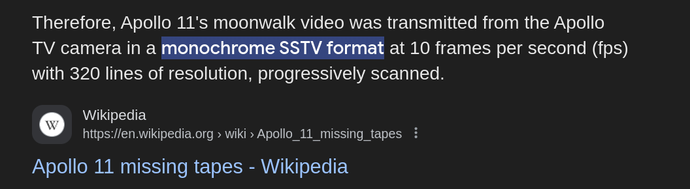
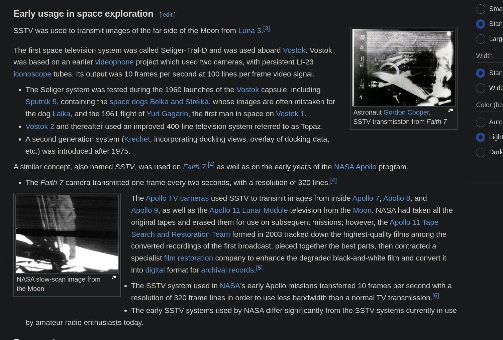
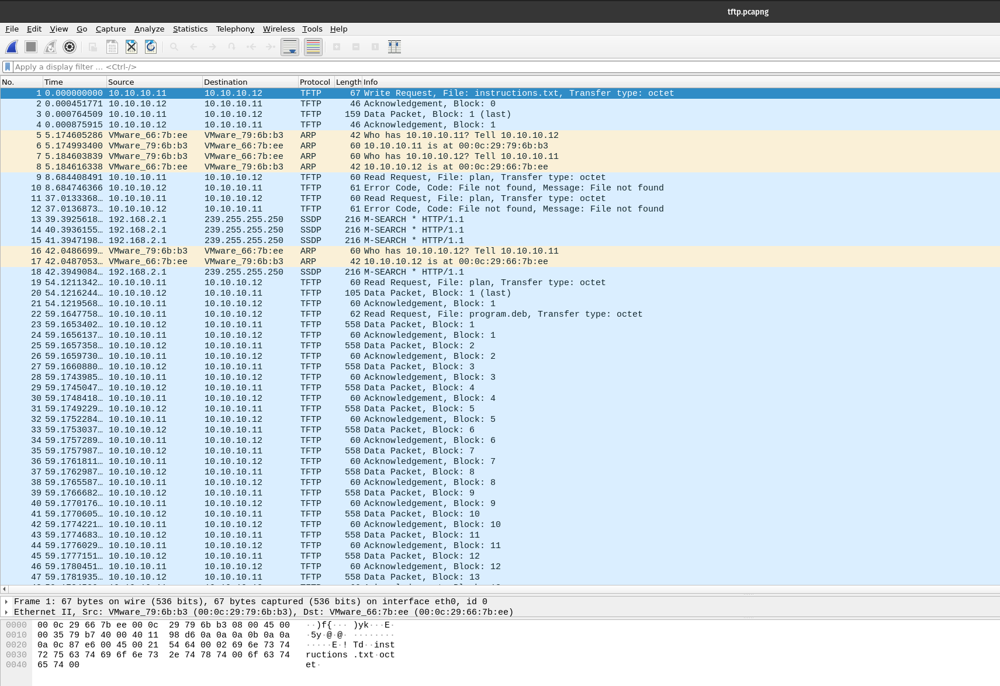
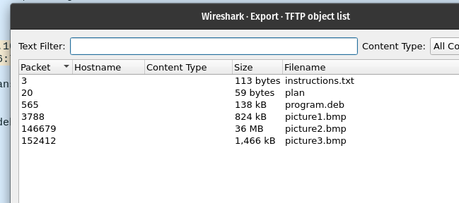

# m00nwalk

At first I tried to decode the audio file provided using morse code but that resulted in being inconclusive. The waveform of the audio did not seem to provide any results.

I tried searching for the format the Apollo mission used to transmit images and I found:

I found this [github repository](https://github.com/colaclanth/sstv) that contained a sstv decoder and used it to decode the audio file.

On decoding, you get the result:

Rotating the image gives you the flag: `picoCTF{beep_boop_im_in_space}`

# Trivial Flag Transfer Protocol

With some reading I found out that a `pcapng` file contains network packet data and can be opened with a program called wireshark.

The `TFTP` protocol seems to be used and the `instructions.txt` in the image indicates file transfer to have taken place.

I check for `TFTP` objects and I find and save the following files.

The `program.deb` file installs `steghide` a steganography tool which indicates that the flag might be hidden in the images.

`instructions.txt` contains the text `GSGCQBRFAGRAPELCGBHEGENSSVPFBJRZHFGQVFTHVFRBHESYNTGENAFSRE.SVTHERBHGNJNLGBUVQRGURSYNTNAQVJVYYPURPXONPXSBEGURCYNA`. I tried decoding it with a couple common encryption algorithms until rot13 gave me the result `TFTPDOESNTENCRYPTOURTRAFFICSOWEMUSTDISGUISEOURFLAGTRANSFER.FIGUREOUTAWAYTOHIDETHEFLAGANDIWILLCHECKBACKFORTHEPLAN`. With spaces this is `TFTP DOESNT ENCRYPT OUR TRAFFIC SO WE MUST DISGUISE OUR FLAGTRANSFER.FIGURE OUT AWAY TO HIDE THE FLAG AND I WILL CHECK BACK FOR THE PLAN`

`plan` contains the text `VHFRQGURCEBTENZNAQUVQVGJVGU-QHRQVYVTRAPR.PURPXBHGGURCUBGBF` which on rot13 decryption gives `IUSEDTHEPROGRAMANDHIDITWITH-DUEDILIGENCE.CHECKOUTTHEPHOTOS`. This might imply that the paraphrase used with steghide is `DUEDILIGENCE`.

I tried decrypting the images one by one with `steghide -sf picture.bmp -p DUEDILIGENCE`. 
On `picture3.bmp` it gave me the output `wrote extracted data to "flag.txt".`

`flag.txt` contained the flag: `picoCTF{h1dd3n_1n_pLa1n_51GHT_18375919}`