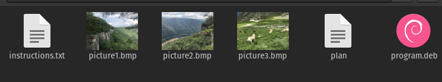

# m00nwalk

At first I tried to decode the audio file provided using morse code but that resulted in being inconclusive. The waveform of the audio did not seem to provide any results.

I tried searching for the format the Apollo mission used to transmit images and I found:

I found this [github repository](https://github.com/colaclanth/sstv) that contained a sstv decoder and used it to decode the audio file.

On decoding, you get the result:

Rotating the image gives you the flag: `picoCTF{beep_boop_im_in_space}`

# Trivial Flag Transfer Protocol

With some reading I found out that a `pcapng` file contains network packet data and can be opened with a program called wireshark.

The `TFTP` protocol seems to be used and the `instructions.txt` in the image indicates file transfer to have taken place.

I check for `TFTP` objects and I find and save the following files.

The `program.deb` file installs `steghide` a steganography tool which indicates that the flag might be hidden in the images.

`instructions.txt` contains the text `GSGCQBRFAGRAPELCGBHEGENSSVPFBJRZHFGQVFTHVFRBHESYNTGENAFSRE.SVTHERBHGNJNLGBUVQRGURSYNTNAQVJVYYPURPXONPXSBEGURCYNA`. I tried decoding it with a couple common encryption algorithms until rot13 gave me the result `TFTPDOESNTENCRYPTOURTRAFFICSOWEMUSTDISGUISEOURFLAGTRANSFER.FIGUREOUTAWAYTOHIDETHEFLAGANDIWILLCHECKBACKFORTHEPLAN`. With spaces this is `TFTP DOESNT ENCRYPT OUR TRAFFIC SO WE MUST DISGUISE OUR FLAGTRANSFER.FIGURE OUT AWAY TO HIDE THE FLAG AND I WILL CHECK BACK FOR THE PLAN`

`plan` contains the text `VHFRQGURCEBTENZNAQUVQVGJVGU-QHRQVYVTRAPR.PURPXBHGGURCUBGBF` which on rot13 decryption gives `IUSEDTHEPROGRAMANDHIDITWITH-DUEDILIGENCE.CHECKOUTTHEPHOTOS`. This might imply that the paraphrase used with steghide is `DUEDILIGENCE`.

I tried decrypting the images one by one with `steghide -sf picture.bmp -p DUEDILIGENCE`. 
On `picture3.bmp` it gave me the output `wrote extracted data to "flag.txt".`

`flag.txt` contained the flag: `picoCTF{h1dd3n_1n_pLa1n_51GHT_18375919}`

# tunn3l v1s10n

I try to open the given file and I see the following:

I change the file name to have the `.bmp` extension but this gives me the same error. The error stated that it image has an unsupported header files so I research about bitmap headers until I find this useful [resource](https://www.ece.ualberta.ca/~elliott/ee552/studentAppNotes/2003_w/misc/bmp_file_format/bmp_file_format.htm)

Opening the file in ghex shows me that the data offset and info header size are wrong and they should be 54(40+14) and 40 bytes respectively.

So I correct this to have `00 00 00 36` and `00 00 00 28` which are 54 and 40 in hex. Their little endian forms are `3600 0000` and `2800 0000`. 
Now I can open the image and it gives me the result:

This is a dummy flag and the actual image seems to be cropped. According to the header specification above I can change the width and height of the image to get the full image. Changing the width gives me no result but changing the height does. 

The original height has the bytes `32 01 00 00` with is `0x132`. I messed around with the value by incrementing it with randomly until `0x342` or `42 03 00 00` gave me the result.

flag: `picoCTF{qu1t3_a_v13w_2020}`