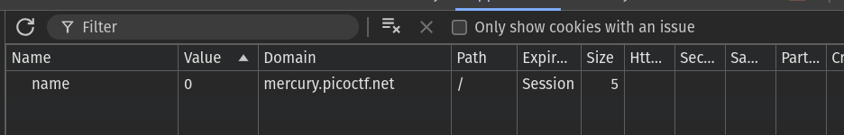
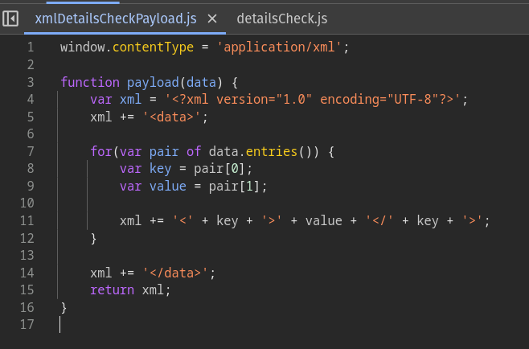
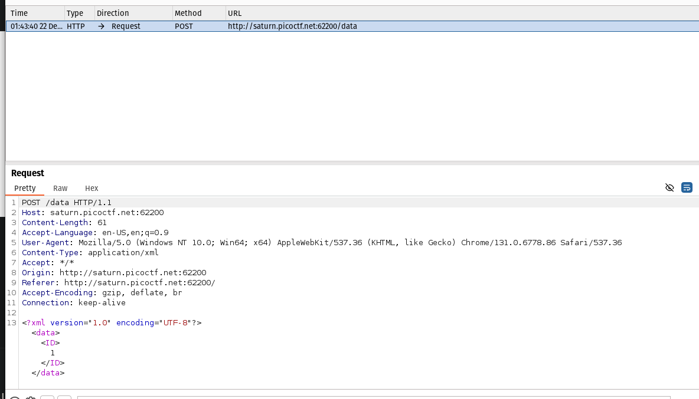
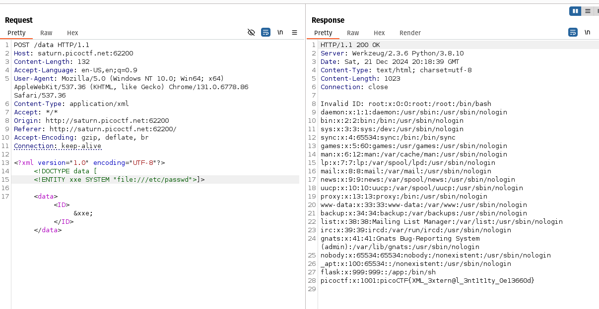

# Forbidden Paths

It is stated that files existed in the directory `/usr/share/nginx/html/ ` and the flag existed in the directory `/flag`. Since absolute files don't work you have to use a relative path.
The website contains a prompt that reads the file of whatever relative path is inputed. Therefore if you input `../../../../flag.txt`, you get the flag.

flag: `picoCTF{7h3_p47h_70_5ucc355_6db46514}`

# cookies

After going to the site and entering the value `snickerdoodle` since it was hinting at it, I see this particular value in the cookies of the application.

On trying to enter another cookie like `chocolate chip` cookie, I see that the value is updated to 1.

Therefore I keep incrementing the value until I get the flag.

At the value 18, I get the flag `picoCTF{3v3ry1_l0v3s_c00k135_94190c8a}` shown in the site.

# SOAP

The website has three interactions with each displaying different text

Both the hint and this file hinted at xml external entity injection so I opened the site up in burp suite

This was confirmed on intercepting a request during a button press and I send this request to the repeater.

I used `https://d00mfist.gitbooks.io/ctf/content/xml_external_entity_attack.html` to create an xxe injection to get the contents of the `/etc/passwd` file.

This gives me the flag: `picoCTF{XML_3xtern@l_3nt1t1ty_0e13660d}`