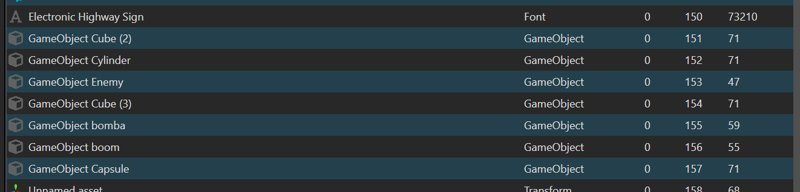
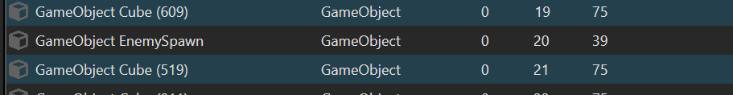
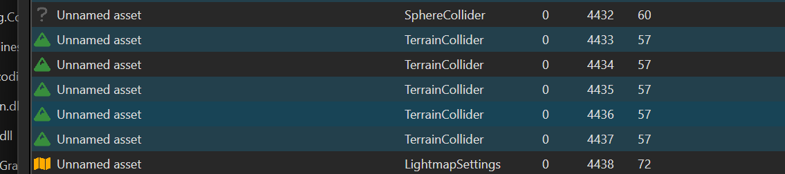
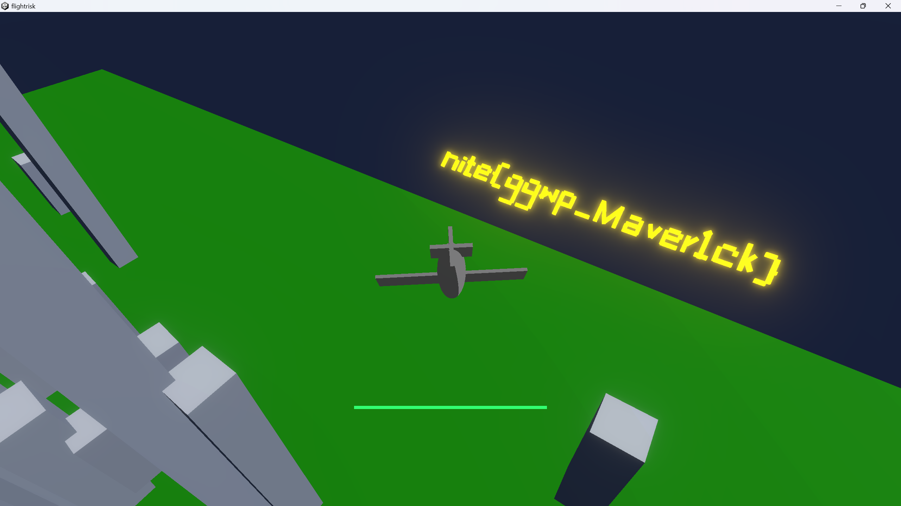

# Flight Risk

The goal of the challenge is pretty much to just reach the other end of the map but the complex terrain and missiles make it impossible.

I do have some experience with unity so I thought of editing(and maybe even deleting) the specific assets that make it a challenge.

I found this [resource](https://github.com/imadr/Unity-game-hacking) on Unity game hacking and decided to use UABE(Unity Asset Bundle Extractor) to edit the game assets.

The assets were contained in the `sharedassets0.assets` and `level0`(took me a while to figure out that level0 was also an asset file) files. I made a copy just in case my changes break the game.

In the sharedassets0.assets file:
o

I found a GameObject Enemy object and assumed it was the missile so I deleted it. On running the game now, no missiles spawn so all I had to deal with was the terrain.

I decided to delete the colliders of the terrain so I will be able to pass through them.

In the level0 file:

I found the enemy spawner and deleted this too. In hindsight, this had no effect on the game and if I had only deleted this and not the game enemy object frome sharedassets, the missiles would have still spawned.

In the same file I found:
 which was exactly what I wanted. I deleted all of this and now I could pass through all the terrain and reach the other end of the map. 

flag: `nite{ggwp_Maver1ck}`